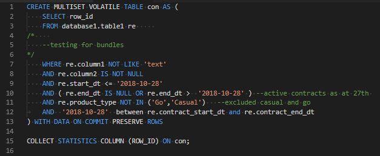
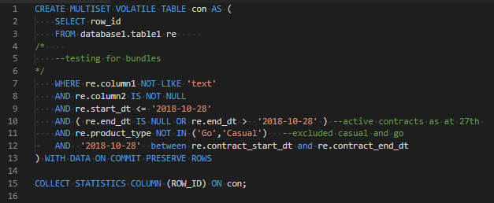

# sql-teradata README

## Features
sql enhancement for teradata. 
Currently only includes colorizer but will be planning more features.

Before

After

## Requirements
No requirements yet.

## Extension Settings
Teseted with Dark+ theme
No settings yet. 

## Known Issues
No known issues

## Release Notes

### 0.2.0
Initial release of sql-teradata

### 0.3.0
Added more keywords specific to Teradata.

